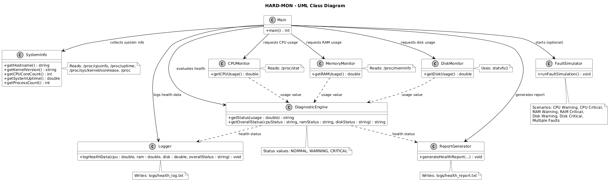
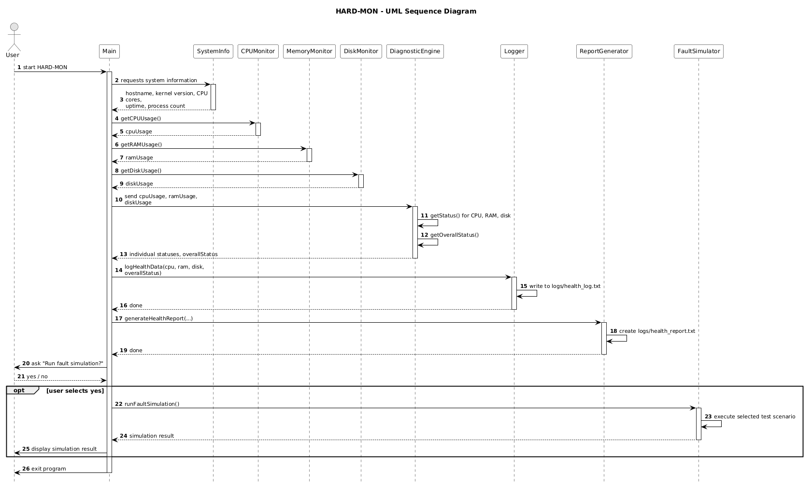
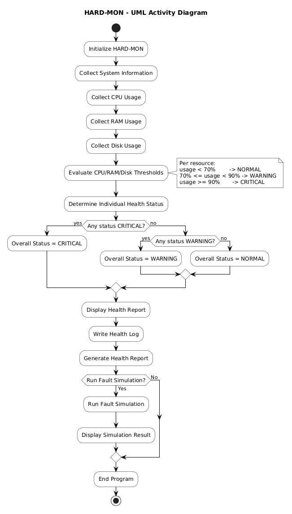

# Stage 3: System Design & Architecture

## 3.1 Overall System Architecture

HARD-MON is designed as a modular, single-process Linux application. Each module performs a specific responsibility and communicates through C++ functions and interfaces.

```text
╔══════════════════════════════════════════════════════════════════╗
║                    HARD-MON Diagnostic System                    ║
║                                                                  ║
║  ┌──────────────────┐       ┌──────────────────────────────┐     ║
║  │System Information│       │       Monitoring Layer       │     ║
║  │                  │       │                              │     ║
║  │ Hostname         │       │  CPU Monitor                 │     ║
║  │ Kernel Version   │       │  Memory Monitor              │     ║
║  │ CPU Cores        │       │  Disk Monitor                │     ║
║  │ Uptime           │       │                              │     ║
║  │ Process Count    │       └──────────────┬───────────────┘     ║
║  └────────┬─────────┘                      │                     ║
║           │                                │                     ║
║           └──────────────┬─────────────────┘                     ║
║                          ▼                                       ║
║                ┌─────────────────────┐                           ║
║                │  Diagnostic Engine  │                           ║
║                │ NORMAL / WARNING /  │                           ║
║                │ CRITICAL            │                           ║
║                └──────────┬──────────┘                           ║
║                           │                                      ║ 
║                 ┌─────────┴─────────┐                            ║ 
║                 ▼                   ▼                            ║
║          ┌──────────────┐    ┌────────────────┐                  ║
║          │    Logger    │    │ Report Generator│                 ║
║          └──────────────┘    └────────────────┘                  ║
║                                                                  ║
║                 Fault Simulation Module                          ║
╚══════════════════════════════════════════════════════════════════╝

                         ▲
                         │
                Linux /proc & filesystem
```

---

## 3.2 Major System Components & Responsibilities

| Component          | Source File             | Responsibility                   |
| ------------------ | ----------------------- | -------------------------------- |
| CPU Monitor        | `cpu_monitor.cpp`       | Calculates CPU utilization       |
| Memory Monitor     | `memory_monitor.cpp`    | Calculates RAM utilization       |
| Disk Monitor       | `disk_monitor.cpp`      | Calculates disk utilization      |
| System Information | `system_info.cpp`       | Collects basic Linux information |
| Diagnostic Engine  | `diagnostic_engine.cpp` | Determines health status         |
| Fault Simulator    | `fault_simulator.cpp`   | Tests abnormal conditions        |
| Logger             | `logger.cpp`            | Stores health results            |
| Report Generator   | `report_generator.cpp`  | Creates health report            |
| Main Controller    | `main.cpp`              | Integrates all modules           |

---

## 3.3 Linux Interfaces Used

HARD-MON uses standard Linux interfaces to obtain system information.

| Linux Interface              | Purpose                    |
| ---------------------------- | -------------------------- |
| `/proc/stat`                 | CPU statistics             |
| `/proc/meminfo`              | Memory information         |
| `/proc/cpuinfo`              | CPU information            |
| `/proc/uptime`               | System uptime              |
| `/proc/sys/kernel/osrelease` | Kernel version             |
| `/proc`                      | Process information        |
| `statvfs()`                  | Disk/filesystem statistics |

---

## 3.4 Core Interfaces

### Monitoring Interface

```cpp
double getCPUUsage();
double getRAMUsage();
double getDiskUsage();
```

### Diagnostic Interface

```cpp
std::string getStatus(double usage);

std::string getOverallStatus(
    const std::string& cpuStatus,
    const std::string& ramStatus,
    const std::string& diskStatus
);
```

### System Information Interface

```cpp
std::string getHostname();
std::string getKernelVersion();
int getCPUCoreCount();
double getSystemUptime();
int getProcessCount();
```

---

## 3.5 UML Diagrams

### 3.5.1 Class Diagram



The class diagram represents the main HARD-MON modules and their relationships.

### 3.5.2 Sequence Diagram



The sequence diagram represents the interaction between the main controller, monitoring modules, diagnostic engine, logger, report generator, and fault simulator.

### 3.5.3 Activity Diagram



The activity diagram represents the execution flow of HARD-MON from system information collection through health analysis, logging, reporting, and optional fault simulation.

---

## 3.6 Program Execution Flow

```text
START
  ↓
Collect System Information
  ↓
Collect CPU / RAM / Disk Usage
  ↓
Evaluate Thresholds
  ↓
Determine Health Status
  ↓
Display Results
  ↓
Write Health Log
  ↓
Generate Health Report
  ↓
Run Fault Simulation?
  ↓
END
```

---

## 3.7 Threshold Design

| Usage            | Status   |
| ---------------- | -------- |
| Below 70%        | NORMAL   |
| 70% to below 90% | WARNING  |
| 90% or above     | CRITICAL |

Overall health follows:

```text
CRITICAL > WARNING > NORMAL
```

If any monitored resource is CRITICAL, the overall health status becomes CRITICAL.

---

## 3.8 Implementation Plan

The system was implemented in the following order:

1. CPU, RAM and disk monitoring.
2. Diagnostic engine.
3. Fault simulation.
4. System information collection.
5. Logging and report generation.
6. Complete module integration and testing.

---

## 3.9 Version Control & Progress Evidence

* **SDLC Phase:** Stage 3 — System Design & Architecture
* **Language:** C++17
* **Platform:** Ubuntu 24.04 LTS on WSL2
* **Version Control:** Git
* **Evidence:** Source modules, header interfaces, architecture design and UML diagrams.
